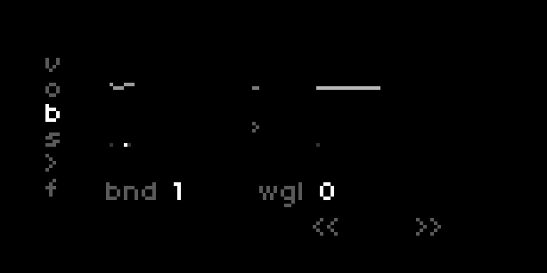

# ~ wrms ~~
dual stereo time-wigglers / echo loopers

two time-travel wrms for loops, delays, & everything in-between

### requirements
- norns
- audio input

### download
head to `norns.local` + click on the books, tab over to available, then scroll way down to wrms & click install 

# how 2 wrm

the first thing you should know is that E1 changes which page is displayed. pages contain different controls, mapped to the lower keys and encoders. the location of the control on-screen (left, right, center) shows which wrm will be affected by your control messing.

the first time you meet the wrms wrm1 (on the left) will be set up as a delay & wrm 2 (on the right) will be configured as a looper pedal. feed the wrms some audio to begin exploring ! tap K3 once to begin recording a loop, then again to begin playback.

# controls

## main screen

- **vol:** the easy one ! change the volume of each respective wrm
- **rec:** set the record state. 
    - if the wrm is asleep (flat line) toggling rec will punch in a new loop time. 
    - for an awake wrm (wiggling), rec sets whether the loop is overdubbing new material, or causes a stutter freeze in a delay. 
    - in an awake state, hold rec to clear the loop (or delay) and put the wrm to sleep. if wrm 1 is being a delay, you can use rec to turn it into a looper (!!).
- **old:** set the overdub/delay feedback level - or the rate at which old material fades away. turn it up in a delay for long echo tails, or turn it down in a loop for tape decay memory loss.
- **bnd:** bnd is the simplest time warping control - K2 fine-tunes wrm1 between 1x & 2x pitch/speed for instant delay bendiness 
    - <Summmary> (when orbiting a black hole, the rate of time is inversely proportional to orbital altitude). 

- **wgl:** wgl is a slow LFO routed to the pitch of both wrms, causing various orbital instabilities. set it to around 0.08 for pleasant tape wow/flutter, or paitiently turn it up to 100 to pass through the singularity & back.
- **<< & >>:** octave transports double and halve the rate of time. hold & release a key for a playable tape glide effect. pressing or holding both keys at once will reverse time.
- **s & l:** the start & length of the playback window. 
    - in delay mode, "l" is the most useful as it sets the time between repeats - ranging from 4-second phrase repeats down to resonator-like phasing at 1 millisecond. 
    - in loop scenarios (esp. with shared buffers) both controls can be used to modify the playback window or scan around buffer space for microlooping or pseudo-granular textures. 
    - (hint: if you cleared wrm1 to put it to sleep, "l" is how you wake it back up as a delay - just increase length from 0.)
- **> & <:** the feed controls set the routing between wrms. by default, the delaying wrm is feed into a looping one, but some may prefer loop into delay. you can also turn up both mix points for a chaotic feedback loop, or set up an infinitely rising pitch cascade when sharing buffers at different recording rates.
- **buf:** simple on the surface, but radical in application, buffer selection allows the wrms to share the same chunk of spacetime memory. 
    - assigning wrm 1 to buffer 2 yeilds a second asyncrnous window into a loop, which you can fine
